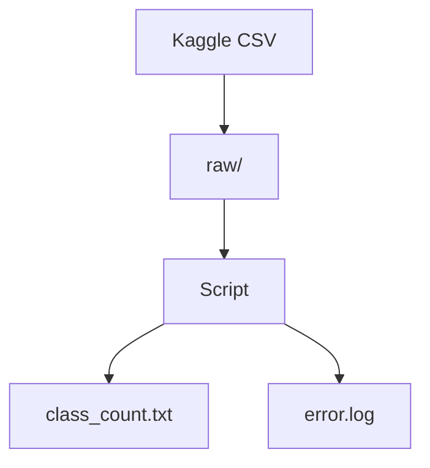

# SDD Document

## Redaccion de documentacion

### Fuente de datos:

    Dataset Titanic

### Transformaciones:

    Filtrar columna de clases de pasajeros
    Contar cuantos pasajeros hay por clases
    Dejarlo registrado en archivo txt
    Crear log de errores

## Diagrama

## Avisos

    El script esta pensado para ejecutarse desde la carpeta scripts
    Se le pidio ayuda a IA para profesionalizar el script sobre todo con temas de ubicaciones de carpetas y archivos
