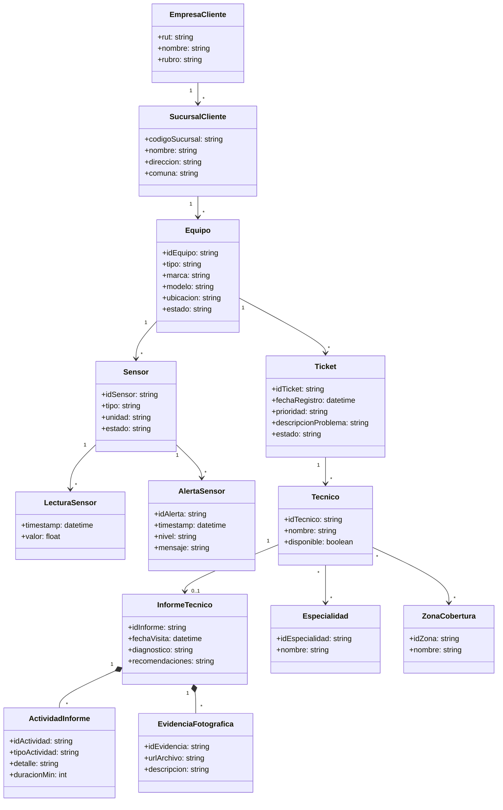
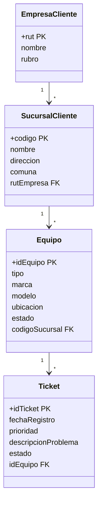

## I. Modelo conceptual del caso

El proceso de negocio modelado corresponde a la **gestión de mantenciones técnicas de unidades de climatización** instaladas en sucursales de una empresa cliente.

El objetivo principal es apoyar el control operativo de mantenciones, permitiendo:

- identificar empresas, sucursales y equipos instalados;
- registrar tickets o eventos técnicos asociados a los equipos;
- controlar informes técnicos, actividades realizadas y evidencias fotográficas;
- consultar lecturas y alertas generadas por sensores;
- asignar técnicos según especialidad y zona de cobertura.

### Entidades consideradas

- EmpresaCliente
- SucursalCliente
- Equipo
- Ticket
- InformeTecnico
- ActividadInforme
- EvidenciaFotografica
- Sensor
- LecturaSensor
- AlertaSensor
- Tecnico
- Especialidad
- ZonaCobertura

### Diagrama de clases UML conceptual



---

## II. Consultas relevantes del caso

Las consultas relevantes para el proceso son:

- listado de equipos registrados por empresa y sucursal;
- listado de tickets por equipo asociado y sucursal;
- registro de informes técnicos asociados a tickets;
- consulta de informes que incluyan determinadas actividades;
- consulta de lecturas de sensores por fecha;
- consulta de alertas operacionales generadas por sensores;
- consulta de técnicos disponibles según especialidad y zona de cobertura.

---

# III. Desarrollo de las preguntas

## 1. Distribución del modelo conceptual por paradigma

| Paradigma                | Clases asignadas                                       | Justificación                                                                                                                                                                                                                                                                                                                                                                                                                                                                                                                                                                                                                                                                                                                                                                                |
| ------------------------ | ------------------------------------------------------ | -------------------------------------------------------------------------------------------------------------------------------------------------------------------------------------------------------------------------------------------------------------------------------------------------------------------------------------------------------------------------------------------------------------------------------------------------------------------------------------------------------------------------------------------------------------------------------------------------------------------------------------------------------------------------------------------------------------------------------------------------------------------------------------------- |
| **Relacional (SQL)**     | EmpresaCliente, SucursalCliente, Equipo, Ticket        | Se decidió modelar estas clases en SQL porque representan la estructura principal y más estable del sistema. En el modelo conceptual existe una relación jerárquica clara: una empresa tiene sucursales, cada sucursal tiene equipos y los equipos pueden generar tickets. Las consultas definidas necesitan cruzar estos datos para saber qué equipos o tickets están asociados a una empresa, una sucursal o un equipo específico. Además, el modelo relacional permite mantener consistencia mediante claves primarias y foráneas. No se incluyó la clase Técnico en este modelo porque el requisito del trabajo exige no repetir una misma clase en más de un esquema; por eso Técnico se dejó en grafos, donde se representa mejor su relación con especialidades y zonas de cobertura. |
| **Columnar (Cassandra)** | Sensor, LecturaSensor, AlertaSensor                    | Se decidió modelar estas clases en Cassandra porque las lecturas de sensores se generan de forma constante y pueden crecer mucho en el tiempo. Un sensor puede registrar muchas lecturas y, a partir de esas lecturas, generar alertas. Las consultas requieren revisar datos por sensor y por fecha, por ejemplo para consultar alertas recientes. Por volumen e historial, se descartó llevar estas lecturas al modelo relacional, ya que produciría tablas muy grandes y consultas menos eficientes para series temporales.                                                                                                                                                                                                                                                               |
| **Documental (MongoDB)** | InformeTecnico, ActividadInforme, EvidenciaFotografica | Se decidió modelar estas clases en una base documental porque existe una relación de agregación: InformeTecnico funciona como documento principal, mientras que ActividadInforme y EvidenciaFotografica dependen directamente de ese informe. Las consultas requieren recuperar el informe completo de una atención técnica, incluyendo actividades realizadas y fotografías asociadas; por lo tanto, guardarlo como documento permite obtener la información completa en una sola consulta. Se descartó separarlas en tablas relacionales porque obligaría a realizar varias uniones para reconstruir un informe que, en la práctica, se consulta como una unidad.                                                                                                                          |
| **Grafos (Neo4j)**       | Tecnico, Especialidad, ZonaCobertura                   | Se decidió modelar estas clases en grafos porque la asignación de técnicos depende de varias relaciones al mismo tiempo. Un técnico puede tener varias especialidades y cubrir una o más zonas; a su vez, una zona puede estar cubierta por distintos técnicos. Las consultas necesitan encontrar el técnico más adecuado según especialidad y zona de cobertura, por lo que el modelo de grafos permite representar estas conexiones de forma más natural que una tabla tradicional.                                                                                                                                                                                                                                                                                                        |

> Restricción cumplida: cada clase conceptual participa en un único esquema.

---

## 2. Transformación conceptual → relacional

### Paso 1: Transformación de entidades fuertes

- EmpresaCliente(rut {PK}, nombre, rubro)
- SucursalCliente(codigo {PK}, nombre, direccion, comuna)
- Equipo(idEquipo {PK}, tipo, marca, modelo, ubicacion, estado)
- Ticket(idTicket {PK}, fechaRegistro, prioridad, descripcionProblema, estado)

### Paso 2: Transformación de entidades débiles

No aplica en este caso, porque no se definieron entidades débiles dentro del subconjunto relacional.

### Paso 3: Asociaciones 1:1

No aplica en este caso, porque no se definieron relaciones 1:1 dentro del subconjunto relacional.

### Paso 4: Asociaciones 1:N

- EmpresaCliente 1:N SucursalCliente  
  Se agrega `rutEmpresa` como FK en SucursalCliente.

- SucursalCliente 1:N Equipo  
  Se agrega `codigoSucursal` como FK en Equipo.

- Equipo 1:N Ticket  
  Se agrega `idEquipo` como FK en Ticket.

### Paso 5: Asociaciones M:N

No aplica en el subconjunto relacional.

### Paso 6: Asociaciones n-arias

No aplica en el subconjunto relacional.

### Paso 7: Relaciones de herencia

No aplica en el subconjunto relacional.

### Esquema relacional en texto

```sql
CREATE TABLE EmpresaCliente (
  rut VARCHAR(12) PRIMARY KEY,
  nombre VARCHAR(120) NOT NULL,
  rubro VARCHAR(80) NOT NULL
);

CREATE TABLE SucursalCliente (
  codigo VARCHAR(20) PRIMARY KEY,
  nombre VARCHAR(120) NOT NULL,
  direccion VARCHAR(150) NOT NULL,
  comuna VARCHAR(80) NOT NULL,
  rutEmpresa VARCHAR(12) NOT NULL,
  FOREIGN KEY (rutEmpresa) REFERENCES EmpresaCliente(rut)
);

CREATE TABLE Equipo (
  idEquipo VARCHAR(20) PRIMARY KEY,
  tipo VARCHAR(60) NOT NULL,
  marca VARCHAR(60) NOT NULL,
  modelo VARCHAR(60) NOT NULL,
  ubicacion VARCHAR(120),
  estado VARCHAR(30) NOT NULL,
  codigoSucursal VARCHAR(20) NOT NULL,
  FOREIGN KEY (codigoSucursal) REFERENCES SucursalCliente(codigo)
);

CREATE TABLE Ticket (
  idTicket VARCHAR(20) PRIMARY KEY,
  fechaRegistro TIMESTAMP NOT NULL,
  prioridad VARCHAR(20) NOT NULL,
  descripcionProblema TEXT NOT NULL,
  estado VARCHAR(30) NOT NULL,
  idEquipo VARCHAR(20) NOT NULL,
  FOREIGN KEY (idEquipo) REFERENCES Equipo(idEquipo)
);
```

### Diagrama UML del modelo relacional



---

## 3. Consultas SQL y posible respuesta

### Consulta SQL 1: equipos registrados por empresa y sucursal

```sql
SELECT ec.nombre AS empresa,
       sc.nombre AS sucursal,
       e.idEquipo,
       e.tipo,
       e.estado
FROM EmpresaCliente ec
JOIN SucursalCliente sc ON sc.rutEmpresa = ec.rut
JOIN Equipo e ON e.codigoSucursal = sc.codigo
ORDER BY ec.nombre, sc.nombre;
```

**Posible resultado:**

| empresa      | sucursal     | idEquipo | tipo        | estado        |
| ------------ | ------------ | -------- | ----------- | ------------- |
| FrioSur Ltda | Planta Norte | EQ-101   | Chiller     | Operativo     |
| FrioSur Ltda | Planta Norte | EQ-102   | Cámara Fría | Mantenimiento |

### Consulta SQL 2: tickets por equipo y sucursal con prioridad alta

```sql
SELECT t.idTicket,
       t.fechaRegistro,
       t.estado,
       e.idEquipo,
       sc.nombre AS sucursal
FROM Ticket t
JOIN Equipo e ON e.idEquipo = t.idEquipo
JOIN SucursalCliente sc ON sc.codigo = e.codigoSucursal
WHERE t.prioridad = 'Alta';
```

**Posible resultado:**

| idTicket | fechaRegistro    | estado  | idEquipo | sucursal     |
| -------- | ---------------- | ------- | -------- | ------------ |
| TK-9001  | 10-05-2026 09:20 | Abierto | EQ-102   | Planta Norte |

---

## 4. Modelo orientado a columnas: Cassandra

Para el modelo columnar se utiliza un diseño orientado por consultas. Las tablas se construyen para consultar lecturas y alertas por sensor y fecha, evitando joins y favoreciendo la lectura eficiente de series temporales.

```sql
CREATE KEYSPACE soporte
WITH replication = {'class':'SimpleStrategy','replication_factor':1};

CREATE TABLE soporte.lecturas_por_sensor (
  id_sensor text,
  fecha date,
  ts timestamp,
  valor double,
  tipo_sensor text,
  PRIMARY KEY ((id_sensor, fecha), ts)
) WITH CLUSTERING ORDER BY (ts DESC);

CREATE TABLE soporte.alertas_por_sensor (
  id_sensor text,
  fecha date,
  ts timestamp,
  id_alerta text,
  nivel text,
  mensaje text,
  PRIMARY KEY ((id_sensor, fecha), ts, id_alerta)
) WITH CLUSTERING ORDER BY (ts DESC);
```

---

## 5. Consultas CQL y posible respuesta

### Consulta CQL 1: lecturas de un sensor según fecha

```sql
SELECT ts, valor
FROM soporte.lecturas_por_sensor
WHERE id_sensor='S-88' AND fecha='2026-05-10'
LIMIT 3;
```

**Posible resultado:**

| ts               | valor |
| ---------------- | ----- |
| 10-05-2026 12:30 | 4.2   |
| 10-05-2026 12:20 | 4.4   |
| 10-05-2026 12:10 | 4.1   |

### Consulta CQL 2: alertas por sensor y fecha

```sql
SELECT ts, nivel, mensaje
FROM soporte.alertas_por_sensor
WHERE id_sensor='S-88' AND fecha='2026-05-10';
```

**Posible resultado:**

| ts                  | nivel | mensaje                              |
| ------------------- | ----- | ------------------------------------ |
| 2026-05-10 12:25:00 | Alta  | Temperatura fuera de rango permitido |
| 2026-05-10 11:50:00 | Media | Variación anormal de lectura         |

---

## 6. Modelo documental: MongoDB

En MongoDB se representa el informe técnico como documento principal. Las actividades y evidencias se almacenan como arreglos embebidos porque dependen del informe y normalmente se consultan junto con él.

### Documento 1

```json
{
  "_id": "INF-1001",
  "idTicket": "TK-9001",
  "fechaVisita": "2026-05-10T11:00:00Z",
  "diagnostico": "Fuga menor en línea de refrigerante",
  "recomendaciones": "Reemplazar sello y recalibrar presión",
  "actividades": [
    {
      "idActividad": "ACT-1",
      "tipo": "Inspección",
      "detalle": "Revisión visual de válvulas",
      "duracionMin": 25
    },
    {
      "idActividad": "ACT-2",
      "tipo": "Corrección",
      "detalle": "Ajuste de sello",
      "duracionMin": 40
    }
  ],
  "evidencias": [
    {
      "idEvidencia": "EVD-1",
      "url": "https://img/1.jpg",
      "descripcion": "Válvula antes de ajuste"
    },
    {
      "idEvidencia": "EVD-2",
      "url": "https://img/2.jpg",
      "descripcion": "Válvula después de ajuste"
    }
  ]
}
```

### Documento 2

```json
{
  "_id": "INF-1002",
  "idTicket": "TK-9002",
  "fechaVisita": "2026-05-12T15:30:00Z",
  "diagnostico": "Sensor con lectura intermitente",
  "recomendaciones": "Cambiar cableado y validar conexión",
  "actividades": [
    {
      "idActividad": "ACT-3",
      "tipo": "Diagnóstico",
      "detalle": "Prueba de continuidad",
      "duracionMin": 30
    }
  ],
  "evidencias": [
    {
      "idEvidencia": "EVD-3",
      "url": "https://img/3.jpg",
      "descripcion": "Conector sulfatado"
    }
  ]
}
```

---

## 7. Consultas MQL y posible respuesta

### Consulta MQL 1: informes técnicos que tienen actividades de corrección

```javascript
db.informes.find(
  { "actividades.tipo": "Corrección" },
  { _id: 1, idTicket: 1, fechaVisita: 1, actividades: 1 },
);
```

**Posible resultado:**

```json
[
  {
    "_id": "INF-1001",
    "idTicket": "TK-9001",
    "fechaVisita": "2026-05-10T11:00:00Z",
    "actividades": [
      {
        "idActividad": "ACT-1",
        "tipo": "Inspección",
        "detalle": "Revisión visual de válvulas",
        "duracionMin": 25
      },
      {
        "idActividad": "ACT-2",
        "tipo": "Corrección",
        "detalle": "Ajuste de sello",
        "duracionMin": 40
      }
    ]
  }
]
```

### Consulta MQL 2: cantidad de actividades técnicas por tipo durante un periodo

```javascript
db.informes.aggregate([
  {
    $match: {
      fechaVisita: { $gte: ISODate("2026-05-01"), $lt: ISODate("2026-06-01") },
    },
  },
  { $unwind: "$actividades" },
  { $group: { _id: "$actividades.tipo", total: { $sum: 1 } } },
]);
```

**Posible resultado:**

```json
[
  { "_id": "Inspección", "total": 1 },
  { "_id": "Corrección", "total": 1 },
  { "_id": "Diagnóstico", "total": 1 }
]
```

---

## 8. Modelo de grafos: Neo4j

```cypher
CREATE (t1:Tecnico {id:'TEC-01', nombre:'Ana Rojas', disponible:true})
CREATE (t2:Tecnico {id:'TEC-02', nombre:'Luis Paredes', disponible:true})
CREATE (e1:Especialidad {id:'ESP-REF', nombre:'Refrigeración'})
CREATE (e2:Especialidad {id:'ESP-ELE', nombre:'Electricidad'})
CREATE (z1:ZonaCobertura {id:'Z-NORTE', nombre:'Zona Norte'})
CREATE (z2:ZonaCobertura {id:'Z-CENTRO', nombre:'Zona Centro'})
CREATE (t1)-[:TIENE_ESPECIALIDAD]->(e1)
CREATE (t1)-[:CUBRE_ZONA]->(z1)
CREATE (t2)-[:TIENE_ESPECIALIDAD]->(e2)
CREATE (t2)-[:CUBRE_ZONA]->(z1)
CREATE (t2)-[:CUBRE_ZONA]->(z2);
```

---

## 9. Consultas Cypher y posible respuesta

### Consulta Cypher: encontrar técnicos disponibles según especialidad y zona

```cypher
MATCH (t:Tecnico)-[:TIENE_ESPECIALIDAD]->(e:Especialidad),
      (t)-[:CUBRE_ZONA]->(z:ZonaCobertura)
WHERE t.disponible = true
  AND e.nombre = 'Refrigeración'
  AND z.nombre = 'Zona Norte'
RETURN t.id, t.nombre;
```

**Posible resultado:**

| t.id   | t.nombre  |
| ------ | --------- |
| TEC-01 | Ana Rojas |

---

## Cierre de coherencia

La propuesta separa el dominio según la semántica y el patrón de acceso de cada grupo de clases:

- el núcleo estable de empresa, sucursal, equipo y ticket se mantiene en el modelo relacional;
- la telemetría histórica de sensores se modela en Cassandra por volumen y acceso temporal;
- los informes técnicos se representan como documentos porque forman agregados naturales con actividades y evidencias;
- la asignación de técnicos se modela como grafo porque depende de conexiones entre técnicos, especialidades y zonas.

Con esto se cumple la restricción de que cada clase conceptual participa en un solo esquema, manteniendo coherencia técnica entre el modelo conceptual, las consultas y la transformación a cada paradigma de base de datos.
